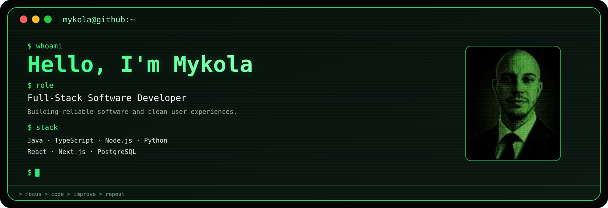

  

## $ about

Full-Stack Software Developer with 7 years of experience in fintech, specializing in payment systems. Expertise in JavaScript, Node.js, Python, and Java, with strong front-end and back-end development experience, API integration, and optimization of transaction-processing systems and banking APIs.

## $ currently

Currently interested in:

- React and Next.js for front-end development
- Node.js, Java, and Python for back-end development
- Distributed systems
- System design
- Developer tooling

## $ openSourceContributions

### [FOAM3](https://github.com/foam-foundation/foam3)

Professional contribution to an open-source project as part of my work at [Nanopay].

- Referral Code Generation — designed and implemented a user-readable referral code generation system
- XML Framework Support — extended XML parsing and enum/array handling
- Scheduled Execution — implemented schedulable run-script functionality
- File/DAO Improvements — improved large-file persistence and document handling
- Fintech Features — implemented referral, payment, KYC and approval-flow functionality
- Framework Bug Fixes — contributed fixes across FOAM's core framework and UI

[View contributions →](https://github.com/foam-foundation/foam3/pulls?page=1&q=is%3Apr+is%3Aclosed+author%3AKolombetM)

### [KZG library for Ethereum Data Sharding](https://github.com/grandinetech/rust-kzg)

Professional contribution to an open-source project as part of my work at [Nanopay].

- Added zkcrypto support to the library

[View contributions →](https://github.com/grandinetech/rust-kzg/pull/190)

## $ hobbies

Outside of work, I enjoy learning French, reading about software architecture, building side projects, and playing chess.

  
  
  

